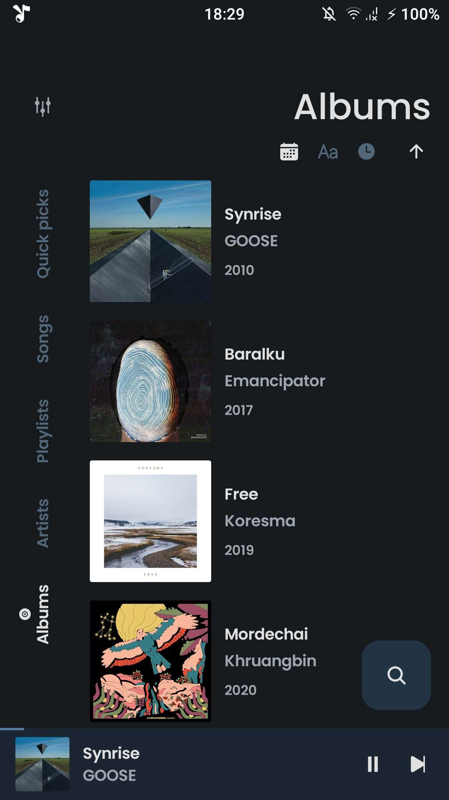
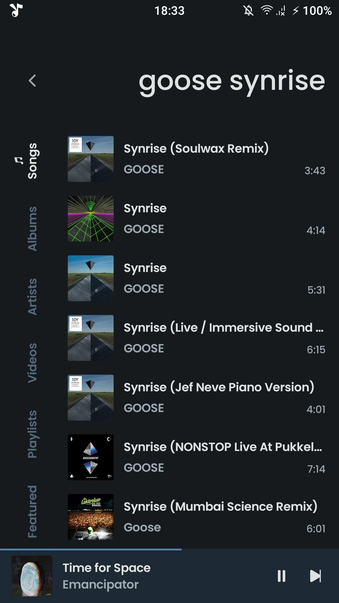
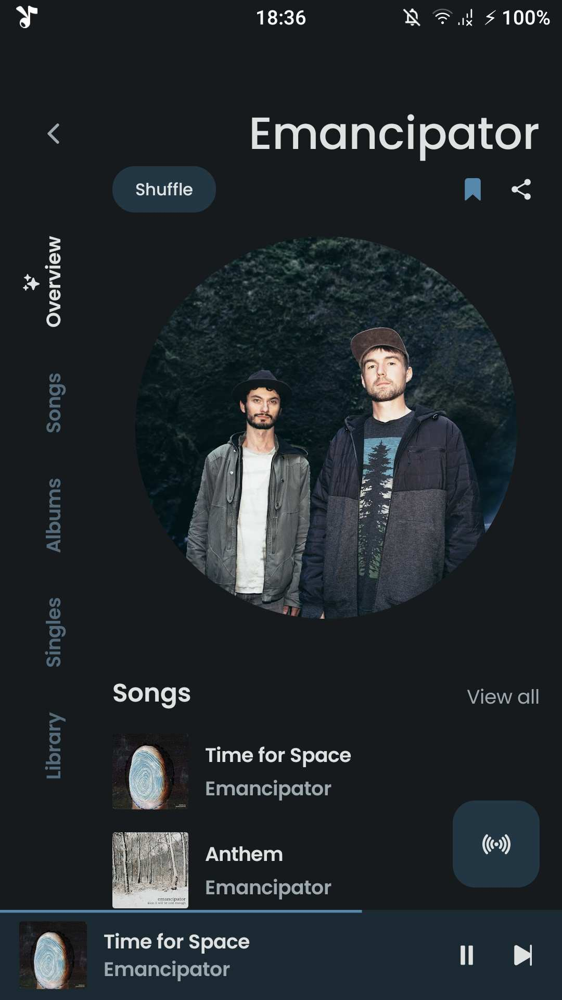

<div align="center">
    
    <h1>ViMusic</h1>
    <p>An Android application for streaming music from YouTube Music</p>
</div>

---

<p align="center">
  
  
  

  
  
  
</p>

## About translation
- It's the best app, so I Japanese translated it for me and my friends.
- There are intentionally some parts that are not in Japanese.
- The license has been modified from the one originally created by vfsfitvnm. Please use it under the GPL-3.0 license.

## Features
- Play (almost) any song or video from YouTube Music
- Background playback
- Cache audio chunks for offline playback
- Search for songs, albums, artists videos and playlists
- Bookmark artists and albums
- Import playlists
- Fetch, display and edit songs lyrics or synchronized lyrics
- Local playlist management
- Reorder songs in playlist or queue
- Light/Dark/Dynamic theme
- Skip silence
- Sleep timer
- Audio normalization
- Android Auto
- Persistent queue
- Open YouTube/YouTube Music links (`watch`, `playlist`, `channel`)
- ...

## Installation
- Currently, the Japanese version is distributed only on GitHub. In the case of IzzyOnDroid and F-Droid, it will redirect to the original link by vfsfitvnm.

[](https://github.com/haturatu/ViMusic/releases/latest)
[](https://apt.izzysoft.de/fdroid/index/apk/it.vfsfitvnm.vimusic)
[](https://f-droid.org/packages/it.vfsfitvnm.vimusic/)

## Build
### Requirements
- JDK 17 (OpenJDK)
- Android SDK cmdline-tools (latest)
- Android SDK
- Android SDK platform-tools
- Android SDK build-tools r36.1

### Install (Arch Linux)
```bash
sudo pacman -S jdk17-openjdk
yay -S android-sdk-cmdline-tools-latest android-sdk android-sdk-platform-tools android-sdk-build-tools
```

### Environment variables (.bashrc)
```bash
export JAVA_HOME=/usr/lib/jvm/java-17-openjdk
export PATH=$JAVA_HOME/bin:$PATH
export ANDROID_HOME=/opt/android-sdk
export ANDROID_SDK_ROOT=/opt/android-sdk
export PATH=$PATH:/opt/android-sdk/cmdline-tools/latest/bin:/opt/android-sdk/platform-tools
```

### User-local SDK (copy cmdline-tools)
If your SDK under `/opt/android-sdk` is read-only, copy cmdline-tools to a user-writable SDK:

```bash
mkdir -p ~/.android-sdk/cmdline-tools/
cp -pr /opt/android-sdk/cmdline-tools/latest ~/.android-sdk/cmdline-tools/
```

Then update the `.bashrc` environment variables to point to the user-local SDK (see the section above).

Accept licenses and install required packages:

```bash
sdkmanager --licenses
sdkmanager "platforms;android-35" "build-tools;34.0.0"
```

### local.properties
```bash
cp local.properties.example local.properties
```

Then edit `local.properties` to match your SDK path:

```
sdk.dir=/home/youruser/.android-sdk
```

### Build APK
```bash
make build
```

The debug APK will be generated at:

`app/build/outputs/apk/debug/app-debug.apk`

## Acknowledgments
- [**YouTube-Internal-Clients**](https://github.com/zerodytrash/YouTube-Internal-Clients): A python script that discovers hidden YouTube API clients. Just a research project.
- [**ionicons**](https://github.com/ionic-team/ionicons): Premium hand-crafted icons built by Ionic, for Ionic apps and web apps everywhere.

<a href="https://www.flaticon.com/authors/ilham-fitrotul-hayat" title="music icons">App icon based on icon created by Ilham Fitrotul Hayat - Flaticon</a>

## Disclaimer
This project and its contents are not affiliated with, funded, authorized, endorsed by, or in any way associated with YouTube, Google LLC or any of its affiliates and subsidiaries.

Any trademark, service mark, trade name, or other intellectual property rights used in this project are owned by the respective owners.

## Maintainers
If you plan to maintain or release this app yourself, generate your own signing certificate before creating a release build:

```bash
keytool -genkeypair -v -keystore vimusic-release.jks -keyalg RSA -keysize 4096 -validity 10000 -alias vimusic
```

For `make release`, set the signing properties in `~/.gradle/gradle.properties`:

```
VIMUSIC_KEYSTORE_PASSWORD=your_password
VIMUSIC_KEY_PASSWORD=your_password
VIMUSIC_KEY_ALIAS=vimusic
```

When updating the app version, bump the `version` value in `gradle.properties`.
